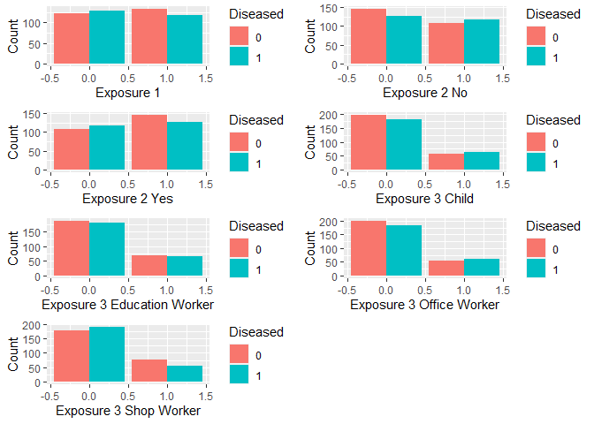

<!-- README.md is generated from README.Rmd. Please edit that file -->

# hospEpi

<!-- badges: start -->
<!-- badges: end -->

The goal of `hospEpi` is to provide useful functions for epidemiological
analyses in a hospital setting. Functions so far deal with summarizing
and plotting patient location history data and disease-exposure (or risk
factor) data.

## Installation

You can install the development version of `hospEpi` like so:

``` r
devtools::install_github("npeters1322/hospEpi", build_vignettes = TRUE)
```

Using `build_vignettes = TRUE` makes sure the package vignette is built
when you install the package, which might be useful if you want to
explore the vignette.

## Example

After loading the package, say you have some disease-exposure data you
want to plot and/or summarize. An example dataset comes with the package
and gives a simple idea of what your data should look like (at least for
the most part) before using any functions.

``` r
#use the example disease-exposure dataset from the package
de_data <- disease_expose_data
head(de_data)
#>   id disease exposure1 exposure2        exposure3
#> 1  1      No         0        No            child
#> 2  2      No         0       Yes    office worker
#> 3  3      No         1        No      shop worker
#> 4  4     Yes         0        No            child
#> 5  5      No         1       Yes education worker
#> 6  6     Yes         1        No    office worker
```

To work with my plot and summary functions, you’ll want a dataset that
only contains 0s and 1s in each variable, so you should clean your data
using another function in this package if your data is not like that.

``` r
#clean the disease-exposure data
cleaned_de_data <- clean_disease_expose(data = de_data, disease = "disease", noDisease = "No", exposures = c(3,4,5))
head(cleaned_de_data)
#>   disease_Yes exposure1 exposure2_No exposure2_Yes exposure3_child
#> 1           0         0            1             0               1
#> 2           0         0            0             1               0
#> 3           0         1            1             0               0
#> 4           1         0            1             0               1
#> 5           0         1            0             1               0
#> 6           1         1            1             0               0
#>   exposure3_education worker exposure3_office worker exposure3_shop worker
#> 1                          0                       0                     0
#> 2                          0                       1                     0
#> 3                          0                       0                     1
#> 4                          0                       0                     0
#> 5                          1                       0                     0
#> 6                          0                       1                     0
```

As you can see above, all columns are now binary. If you look back at
the example data before it was cleaned, you’ll see that for the first
person, exposure3 was “child.” Now, in the cleaned dataset, there is a
binary column for `exposure3_child`, and the first row is marked as 1
because that person was marked as a child in the original dataset.

With cleaned data, we can now make an object of class `disease_expose`.
There are specific summary and plot functions in my package to work with
objects of that class, so if you want to use those, you must create an
object like so:

``` r
de_object <- disease_expose(cleaned_de_data)
class(de_object)
```

    #> [1] "disease_expose" "data.frame"

Calling the `disease_expose` function will pull up a Shiny gadget, which
will allow you to choose your disease column and any exposure columns
you want to bring along from your data, and then it will create an
object of class `disease_expose` if you receive no errors. If a Shiny
gadget is not your thing, you can also manually do everything (choose
your disease column and exposure columns by typing them into the
function) by using the `new_disease_expose` function.

Now that you have a `disease_expose` object, you can plot it by simply
calling the plot function with the necessary arguments. The only
required argument is the `disease_expose` object, but you can also add
additional arguments that will be passed to the `geom_bar` function. For
example:

``` r
plot(de_object, position = 'dodge')
```



Now, you can see grouped bar charts of your disease-exposure
combinations to see if there is anything interesting in the data.

You can also summarize your data like so:

``` r
de_summ <- summary(de_object)
de_summ
#>                            Incidence in Exposed Incidence in Unexposed
#> exposure1                             0.4701195              0.5140562
#> exposure2_No                          0.5221239              0.4671533
#> exposure2_Yes                         0.4671533              0.5221239
#> exposure3_child                       0.5333333              0.4789474
#> exposure3_education worker            0.4887218              0.4931880
#> exposure3_office worker               0.5344828              0.4791667
#> exposure3_shop worker                 0.4198473              0.5176152
#>                            Risk Ratio (RR) RR Lower 95% CI RR Upper 95% CI
#> exposure1                        0.9145294            0.77            1.09
#> exposure2_No                     1.1176715            0.94            1.33
#> exposure2_Yes                    0.8947173            0.75            1.07
#> exposure3_child                  1.1135531            0.91            1.36
#> exposure3_education worker       0.9909442            0.81            1.21
#> exposure3_office worker          1.1154423            0.91            1.36
#> exposure3_shop worker            0.8111187            0.65            1.01
#>                            Odds Ratio (OR) OR Lower 95% CI OR Upper 95% CI
#> exposure1                        0.8386983            0.59            1.19
#> exposure2_No                     1.2462384            0.88            1.77
#> exposure2_Yes                    0.8024147            0.56            1.14
#> exposure3_child                  1.2433281            0.82            1.88
#> exposure3_education worker       0.9822879            0.66            1.46
#> exposure3_office worker          1.2479871            0.82            1.89
#> exposure3_shop worker            0.6744282            0.45            1.01
#>                            Fisher P-Value Chi-Square P-Value
#> exposure1                      0.37104591         0.37179421
#> exposure2_No                   0.24293634         0.25688248
#> exposure2_Yes                  0.24293634         0.25688248
#> exposure3_child                0.34595536         0.35021941
#> exposure3_education worker     1.00000000         1.00000000
#> exposure3_office worker        0.34033555         0.34804377
#> exposure3_shop worker          0.06689589         0.06858653
```

As you can see, the function outputs several different statistics for
each disease-exposure combination and saves them in a `data.frame`,
which would allow for easy extraction if wanted.

There are also multiple functions for patient location history data, and
you can find out how to use those by reading the package vignette or the
help documentation for the functions.
